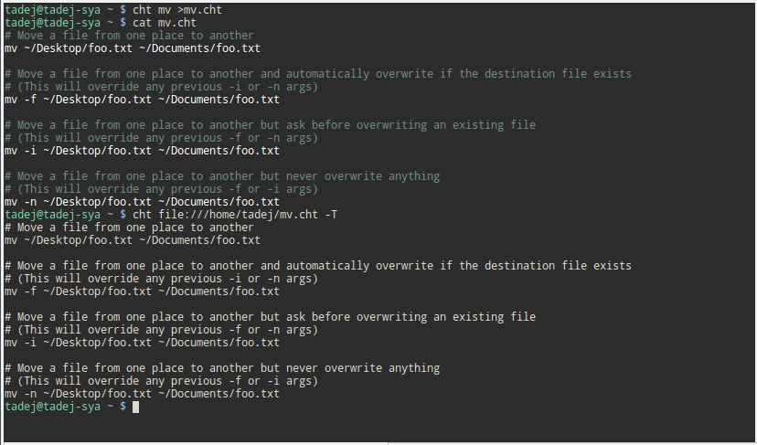

Utillity to gain help, working examples about various commands, APIs, ...

Look in https://github.com/chubin/cheat.sh for more info.

See [Motivation](doc/motivation.md) for reasons this software esists.

# Installation

Just copy [downloaded](https://github.com/tpanj/cht.exe/raw/master/bin/cht.exe) cht.exe to some of your %PATH% dir to use it from every console.

e.g.: copy cht.exe c:\windows\system32 (but you need privileges)

# Usage
Info about shutdown command
```
cht shutdown
```


```
cht c/reverse/2
```


add `-T` parameter after URL not to use coloring at all
```
cht c/strcpy -T
```
Disabling coloring of saved files localy
```
cht file:///tmp/saved_file -T
```


# Compiling
## Windows
Due to document length it is located separately [here](doc/compile_ms.md)

## Linux
### Simplest & quickest
```sh
sudo apt install build-essential libcurl4-openssl-dev
gcc -Wall cht.c -lcurl -o cht
sudo cp ./cht /usr/local/bin/ # "install" it
```
### Static & full under control
```sh
sudo apt install build-essential libcurl4-openssl-dev cmake
```
* download curl from https://curl.haxx.se/download.html,
* unpack it to src folder and rename folder to curl (do not leave it like curl-x.y.z)
```sh
cd curl
cmake -DCURL_STATICLIB=ON .
make libcurl # we need only this mudule
cd ..
mkdir build
cd build
cmake -DCMAKE_BUILD_TYPE=Release ../src
make
sudo cp ./cht /usr/local/bin/ # "install" it
```
## External sources
* https://github.com/tapio/rlutil for cross platform console coloring
* https://github.com/Malvineous/cfgpath for managing config files
* https://github.com/skeeto/optparse adding getopt alternative for parsing args
* https://github.com/tpanj/sccp reading config files
------------------

# TODO:
- [X] windows compile instructions
- [X] complete cmake
- [X] ~~compile with openssl~~ → postponed since this is not needed for now
- [ ] complete functionallity all features of the cht.sh command line

